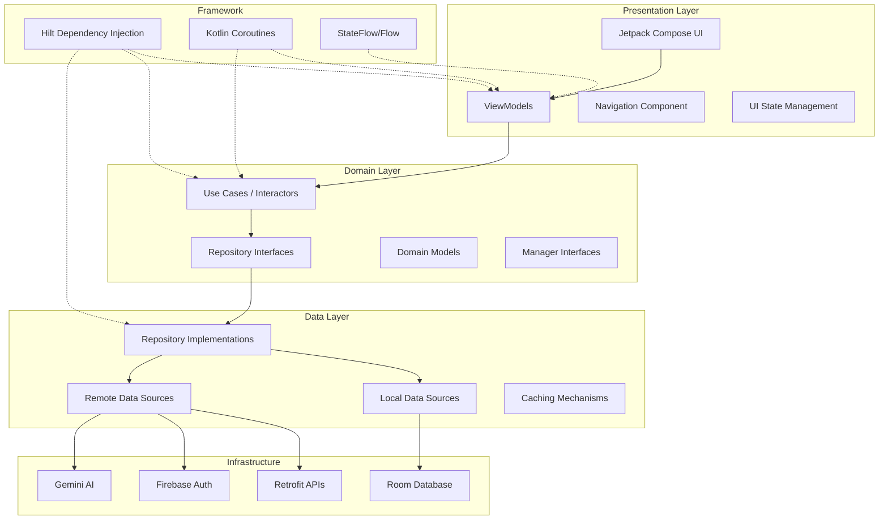
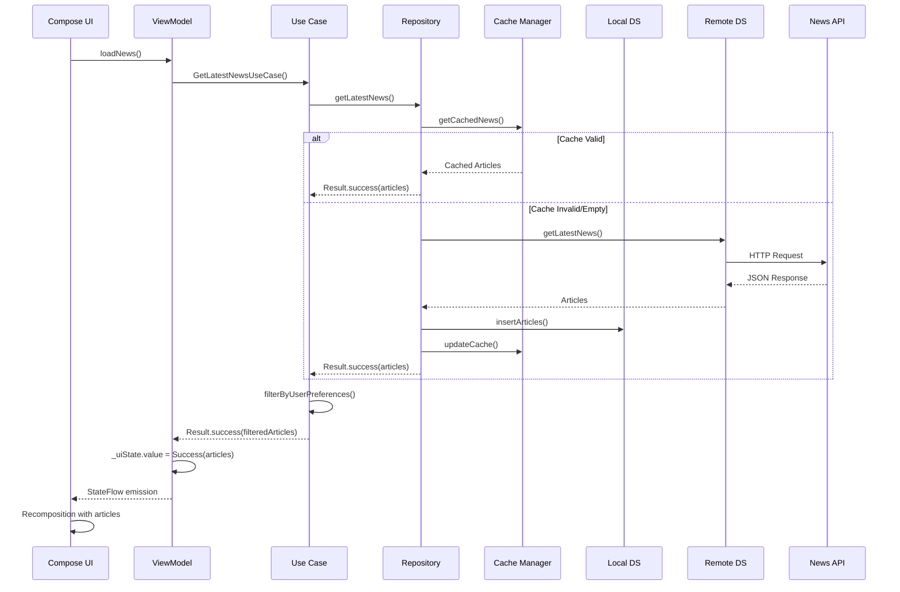
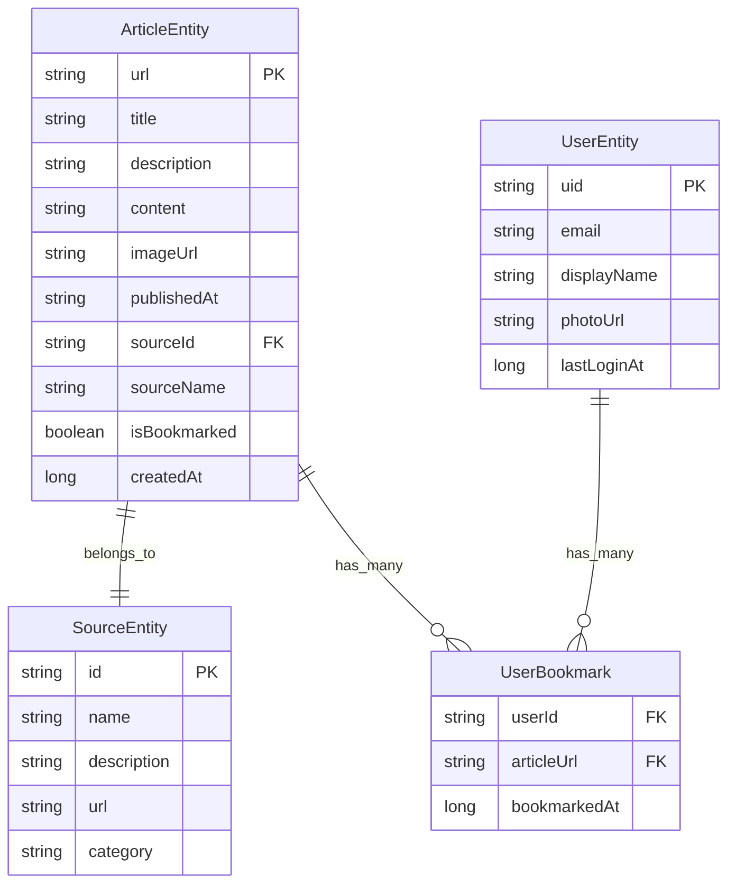

# GRAB Architecture Documentation

This document provides a comprehensive overview of GRAB's architecture, design patterns, and technical implementation details.

## 📋 Table of Contents

- [Architecture Overview](#architecture-overview)
- [Design Patterns](#design-patterns)
- [Layer Architecture](#layer-architecture)
- [Data Flow](#data-flow)
- [Database Design](#database-design)
- [Network Architecture](#network-architecture)
- [Authentication System](#authentication-system)
- [AI Integration](#ai-integration)
- [Performance Optimizations](#performance-optimizations)
- [Security Considerations](#security-considerations)

## 🏗️ Architecture Overview

GRAB follows **Clean Architecture** principles combined with **MVVM (Model-View-ViewModel)** pattern, ensuring separation of concerns, testability, and maintainability.

### Core Architectural Principles

1. **Dependency Inversion**: High-level modules don't depend on low-level modules
2. **Single Responsibility**: Each class has one reason to change
3. **Open/Closed**: Open for extension, closed for modification
4. **Interface Segregation**: Clients shouldn't depend on interfaces they don't use
5. **Dependency Injection**: Dependencies are injected rather than created

### System Architecture Diagram



## 🎯 Design Patterns

### 1. Model-View-ViewModel (MVVM)

```kotlin
// View (Composable)
@Composable
fun HomeScreen(
    viewModel: HomeViewModel = hiltViewModel()
) {
    val uiState by viewModel.uiState.collectAsState()
    
    LaunchedEffect(Unit) {
        viewModel.loadNews()
    }
    
    when (uiState) {
        is HomeUiState.Loading -> LoadingIndicator()
        is HomeUiState.Success -> ArticleList(uiState.articles)
        is HomeUiState.Error -> ErrorMessage(uiState.message)
    }
}

// ViewModel
@HiltViewModel
class HomeViewModel @Inject constructor(
    private val getLatestNewsUseCase: GetLatestNewsUseCase,
    private val userManager: LocalUserManager
) : ViewModel() {
    
    private val _uiState = MutableStateFlow<HomeUiState>(HomeUiState.Loading)
    val uiState: StateFlow<HomeUiState> = _uiState.asStateFlow()
    
    fun loadNews() {
        viewModelScope.launch {
            getLatestNewsUseCase()
                .onSuccess { articles ->
                    _uiState.value = HomeUiState.Success(articles)
                }
                .onFailure { error ->
                    _uiState.value = HomeUiState.Error(error.message ?: "Unknown error")
                }
        }
    }
}

// Model (Domain)
data class Article(
    val title: String,
    val description: String,
    val url: String,
    val imageUrl: String,
    val publishedAt: String,
    val source: Source
)
```

### 2. Repository Pattern

```kotlin
// Repository Interface (Domain Layer)
interface NewsRepository {
    suspend fun getLatestNews(): Result<List<Article>>
    suspend fun searchNews(query: String): Result<List<Article>>
    suspend fun bookmarkArticle(article: Article)
    fun getBookmarkedArticles(): Flow<List<Article>>
}

// Repository Implementation (Data Layer)
@Singleton
class NewsRepositoryImpl @Inject constructor(
    private val remoteDataSource: NewsRemoteDataSource,
    private val localDataSource: NewsLocalDataSource,
    private val cacheManager: CacheManager
) : NewsRepository {
    
    override suspend fun getLatestNews(): Result<List<Article>> = withContext(Dispatchers.IO) {
        try {
            // Try cache first
            cacheManager.getCachedNews()?.let { cachedNews ->
                if (cacheManager.isCacheValid()) {
                    return@withContext Result.success(cachedNews)
                }
            }
            
            // Fetch from remote
            val remoteArticles = remoteDataSource.getLatestNews()
            
            // Cache the results
            localDataSource.insertArticles(remoteArticles)
            cacheManager.updateCache(remoteArticles)
            
            Result.success(remoteArticles)
        } catch (exception: Exception) {
            // Fallback to local data
            val localArticles = localDataSource.getAllArticles()
            if (localArticles.isNotEmpty()) {
                Result.success(localArticles)
            } else {
                Result.failure(exception)
            }
        }
    }
}
```

### 3. Use Case Pattern

```kotlin
// Use Case (Domain Layer)
class GetLatestNewsUseCase @Inject constructor(
    private val newsRepository: NewsRepository,
    private val userManager: LocalUserManager
) {
    suspend operator fun invoke(): Result<List<Article>> {
        return try {
            val userPreferences = userManager.getUserPreferences()
            val articles = newsRepository.getLatestNews().getOrThrow()
            
            // Apply user-specific filtering
            val filteredArticles = filterByUserPreferences(articles, userPreferences)
            
            Result.success(filteredArticles)
        } catch (exception: Exception) {
            Result.failure(exception)
        }
    }
    
    private fun filterByUserPreferences(
        articles: List<Article>,
        preferences: UserPreferences
    ): List<Article> {
        return articles.filter { article ->
            preferences.preferredSources.isEmpty() || 
            article.source.name in preferences.preferredSources
        }.take(preferences.articlesPerPage)
    }
}
```

### 4. Dependency Injection Pattern

```kotlin
// Hilt Modules
@Module
@InstallIn(SingletonComponent::class)
abstract class RepositoryModule {
    
    @Binds
    abstract fun bindNewsRepository(
        newsRepositoryImpl: NewsRepositoryImpl
    ): NewsRepository
    
    @Binds
    abstract fun bindAuthRepository(
        authRepositoryImpl: AuthRepositoryImpl
    ): AuthRepository
}

@Module
@InstallIn(SingletonComponent::class)
object DatabaseModule {
    
    @Provides
    @Singleton
    fun provideNewsDatabase(@ApplicationContext context: Context): NewsDatabase {
        return Room.databaseBuilder(
            context,
            NewsDatabase::class.java,
            "news_database"
        ).build()
    }
    
    @Provides
    fun provideArticleDao(database: NewsDatabase): ArticleDao = database.articleDao()
}

@Module
@InstallIn(SingletonComponent::class)
object NetworkModule {
    
    @Provides
    @Singleton
    fun provideRetrofit(): Retrofit {
        return Retrofit.Builder()
            .baseUrl(Constants.BASE_URL)
            .addConverterFactory(GsonConverterFactory.create())
            .build()
    }
    
    @Provides
    @Singleton
    fun provideNewsApi(retrofit: Retrofit): NewsApi = retrofit.create(NewsApi::class.java)
}
```

## 🏢 Layer Architecture

### Presentation Layer

**Responsibility**: Handle UI logic and user interactions

```kotlin
// UI State Management
sealed class HomeUiState {
    object Loading : HomeUiState()
    data class Success(val articles: List<Article>) : HomeUiState()
    data class Error(val message: String) : HomeUiState()
}

// Navigation Setup
@Composable
fun GrabNavGraph(
    navController: NavHostController,
    startDestination: String
) {
    NavHost(
        navController = navController,
        startDestination = startDestination
    ) {
        composable(Routes.Home) {
            HomeScreen(
                onNavigateToDetails = { article ->
                    navController.navigate("${Routes.Details}/${article.url}")
                }
            )
        }
        
        composable("${Routes.Details}/{articleUrl}") { backStackEntry ->
            val articleUrl = backStackEntry.arguments?.getString("articleUrl")
            DetailsScreen(articleUrl = articleUrl)
        }
    }
}
```

### Domain Layer

**Responsibility**: Business logic and entities

```kotlin
// Domain Models
@Parcelize
data class Article(
    val id: String,
    val title: String,
    val description: String,
    val content: String,
    val url: String,
    val imageUrl: String?,
    val publishedAt: String,
    val source: Source,
    val isBookmarked: Boolean = false
) : Parcelable

data class Source(
    val id: String?,
    val name: String
)

// Use Cases
class SearchNewsUseCase @Inject constructor(
    private val newsRepository: NewsRepository
) {
    suspend operator fun invoke(query: String): Result<List<Article>> {
        return if (query.isBlank()) {
            Result.failure(IllegalArgumentException("Search query cannot be empty"))
        } else {
            newsRepository.searchNews(query.trim())
        }
    }
}

class BookmarkArticleUseCase @Inject constructor(
    private val newsRepository: NewsRepository
) {
    suspend operator fun invoke(article: Article) {
        newsRepository.bookmarkArticle(article.copy(isBookmarked = !article.isBookmarked))
    }
}
```

### Data Layer

**Responsibility**: Data access and manipulation

```kotlin
// Data Sources
interface NewsRemoteDataSource {
    suspend fun getLatestNews(): List<Article>
    suspend fun searchNews(query: String): List<Article>
}

interface NewsLocalDataSource {
    suspend fun getAllArticles(): List<Article>
    suspend fun insertArticles(articles: List<Article>)
    suspend fun getBookmarkedArticles(): List<Article>
    fun getArticlesFlow(): Flow<List<Article>>
}

// Data Source Implementations
@Singleton
class NewsRemoteDataSourceImpl @Inject constructor(
    private val newsApi: NewsApi
) : NewsRemoteDataSource {
    
    override suspend fun getLatestNews(): List<Article> {
        return try {
            val response = newsApi.getTopHeadlines(
                apiKey = BuildConfig.NEWS_API_KEY,
                country = "us",
                pageSize = 20
            )
            response.articles.map { it.toDomainModel() }
        } catch (exception: Exception) {
            throw NetworkException("Failed to fetch news: ${exception.message}")
        }
    }
}

@Singleton
class NewsLocalDataSourceImpl @Inject constructor(
    private val articleDao: ArticleDao
) : NewsLocalDataSource {
    
    override suspend fun getAllArticles(): List<Article> {
        return articleDao.getAllArticles().map { it.toDomainModel() }
    }
    
    override suspend fun insertArticles(articles: List<Article>) {
        articleDao.insertAll(articles.map { it.toEntity() })
    }
    
    override fun getArticlesFlow(): Flow<List<Article>> {
        return articleDao.getAllArticlesFlow().map { entities ->
            entities.map { it.toDomainModel() }
        }
    }
}
```

## 🔄 Data Flow

### Typical Data Flow Example: Loading News Articles



### Error Handling Flow

```kotlin
// Repository Error Handling
override suspend fun getLatestNews(): Result<List<Article>> = withContext(Dispatchers.IO) {
    try {
        val remoteArticles = remoteDataSource.getLatestNews()
        localDataSource.insertArticles(remoteArticles)
        Result.success(remoteArticles)
    } catch (networkException: NetworkException) {
        // Fallback to local data
        val localArticles = localDataSource.getAllArticles()
        if (localArticles.isNotEmpty()) {
            Result.success(localArticles)
        } else {
            Result.failure(networkException)
        }
    } catch (exception: Exception) {
        Result.failure(exception)
    }
}

// ViewModel Error Handling
fun loadNews() {
    viewModelScope.launch {
        _uiState.value = HomeUiState.Loading
        
        getLatestNewsUseCase()
            .onSuccess { articles ->
                _uiState.value = HomeUiState.Success(articles)
            }
            .onFailure { error ->
                _uiState.value = when (error) {
                    is NetworkException -> HomeUiState.Error("Network error. Showing cached articles.")
                    is IllegalArgumentException -> HomeUiState.Error("Invalid request.")
                    else -> HomeUiState.Error("An unexpected error occurred.")
                }
            }
    }
}
```

## 🗄️ Database Design

### Room Database Schema

```kotlin
@Database(
    entities = [
        ArticleEntity::class,
        SourceEntity::class,
        UserEntity::class
    ],
    version = 1,
    exportSchema = true
)
@TypeConverters(Converters::class)
abstract class NewsDatabase : RoomDatabase() {
    abstract fun articleDao(): ArticleDao
    abstract fun sourceDao(): SourceDao
    abstract fun userDao(): UserDao
}

// Entities
@Entity(tableName = "articles")
data class ArticleEntity(
    @PrimaryKey val url: String,
    val title: String,
    val description: String?,
    val content: String?,
    val imageUrl: String?,
    val publishedAt: String,
    val sourceId: String,
    val sourceName: String,
    val isBookmarked: Boolean = false,
    val createdAt: Long = System.currentTimeMillis()
)

@Entity(tableName = "sources")
data class SourceEntity(
    @PrimaryKey val id: String,
    val name: String,
    val description: String?,
    val url: String?,
    val category: String?
)

// Data Access Objects
@Dao
interface ArticleDao {
    @Query("SELECT * FROM articles ORDER BY publishedAt DESC")
    fun getAllArticlesFlow(): Flow<List<ArticleEntity>>
    
    @Query("SELECT * FROM articles WHERE isBookmarked = 1 ORDER BY createdAt DESC")
    fun getBookmarkedArticlesFlow(): Flow<List<ArticleEntity>>
    
    @Query("SELECT * FROM articles WHERE title LIKE :query OR description LIKE :query")
    suspend fun searchArticles(query: String): List<ArticleEntity>
    
    @Insert(onConflict = OnConflictStrategy.REPLACE)
    suspend fun insertAll(articles: List<ArticleEntity>)
    
    @Update
    suspend fun updateArticle(article: ArticleEntity)
    
    @Query("DELETE FROM articles WHERE isBookmarked = 0 AND createdAt < :timestamp")
    suspend fun deleteOldArticles(timestamp: Long)
}
```

### Database Relationships



## 🌐 Network Architecture

### API Layer Design

```kotlin
// Retrofit API Interface
interface NewsApi {
    @GET("top-headlines")
    suspend fun getTopHeadlines(
        @Query("apiKey") apiKey: String,
        @Query("country") country: String = "us",
        @Query("pageSize") pageSize: Int = 20,
        @Query("page") page: Int = 1
    ): NewsResponse
    
    @GET("everything")
    suspend fun searchNews(
        @Query("apiKey") apiKey: String,
        @Query("q") query: String,
        @Query("sortBy") sortBy: String = "publishedAt",
        @Query("pageSize") pageSize: Int = 20,
        @Query("page") page: Int = 1
    ): NewsResponse
}

// Response DTOs
data class NewsResponse(
    val status: String,
    val totalResults: Int,
    val articles: List<ArticleDto>
)

data class ArticleDto(
    val title: String,
    val description: String?,
    val content: String?,
    val url: String,
    val urlToImage: String?,
    val publishedAt: String,
    val source: SourceDto
)

// Network Configuration
@Module
@InstallIn(SingletonComponent::class)
object NetworkModule {
    
    @Provides
    @Singleton
    fun provideOkHttpClient(): OkHttpClient {
        return OkHttpClient.Builder()
            .addInterceptor(ApiKeyInterceptor())
            .addInterceptor(LoggingInterceptor())
            .connectTimeout(30, TimeUnit.SECONDS)
            .readTimeout(30, TimeUnit.SECONDS)
            .build()
    }
    
    @Provides
    @Singleton
    fun provideRetrofit(okHttpClient: OkHttpClient): Retrofit {
        return Retrofit.Builder()
            .baseUrl(BuildConfig.NEWS_API_BASE_URL)
            .client(okHttpClient)
            .addConverterFactory(GsonConverterFactory.create())
            .build()
    }
}

// Custom Interceptors
class ApiKeyInterceptor : Interceptor {
    override fun intercept(chain: Interceptor.Chain): Response {
        val original = chain.request()
        val url = original.url.newBuilder()
            .addQueryParameter("apiKey", BuildConfig.NEWS_API_KEY)
            .build()
        
        val request = original.newBuilder()
            .url(url)
            .build()
        
        return chain.proceed(request)
    }
}
```

## 🔐 Authentication System

### Firebase Authentication Integration

```kotlin
// Authentication Repository
interface AuthRepository {
    suspend fun signInWithGoogle(credential: AuthCredential): Result<User>
    suspend fun signOut(): Result<Unit>
    fun getCurrentUser(): User?
    fun isUserLoggedIn(): Boolean
}

@Singleton
class AuthRepositoryImpl @Inject constructor(
    private val firebaseAuth: FirebaseAuth,
    private val userManager: LocalUserManager
) : AuthRepository {
    
    override suspend fun signInWithGoogle(credential: AuthCredential): Result<User> = 
        withContext(Dispatchers.IO) {
            try {
                val authResult = firebaseAuth.signInWithCredential(credential).await()
                val firebaseUser = authResult.user ?: throw AuthException("Authentication failed")
                
                val user = User(
                    uid = firebaseUser.uid,
                    email = firebaseUser.email ?: "",
                    displayName = firebaseUser.displayName ?: "",
                    photoUrl = firebaseUser.photoUrl?.toString()
                )
                
                userManager.saveUser(user)
                Result.success(user)
            } catch (exception: Exception) {
                Result.failure(AuthException("Google Sign-In failed: ${exception.message}"))
            }
        }
}

// Google Sign-In ViewModel
@HiltViewModel
class AuthViewModel @Inject constructor(
    private val authRepository: AuthRepository,
    private val userManager: LocalUserManager
) : ViewModel() {
    
    private val _authState = MutableStateFlow<AuthState>(AuthState.Loading)
    val authState: StateFlow<AuthState> = _authState.asStateFlow()
    
    init {
        checkAuthStatus()
    }
    
    fun signInWithGoogle(credential: AuthCredential) {
        viewModelScope.launch {
            _authState.value = AuthState.Loading
            
            authRepository.signInWithGoogle(credential)
                .onSuccess { user ->
                    _authState.value = AuthState.Authenticated(user)
                }
                .onFailure { error ->
                    _authState.value = AuthState.Error(error.message ?: "Authentication failed")
                }
        }
    }
    
    private fun checkAuthStatus() {
        viewModelScope.launch {
            val user = authRepository.getCurrentUser()
            _authState.value = if (user != null) {
                AuthState.Authenticated(user)
            } else {
                AuthState.Unauthenticated
            }
        }
    }
}

sealed class AuthState {
    object Loading : AuthState()
    object Unauthenticated : AuthState()
    data class Authenticated(val user: User) : AuthState()
    data class Error(val message: String) : AuthState()
}
```

## 🤖 AI Integration

### Gemini API Integration

```kotlin
// AI Chat Repository
interface AiChatRepository {
    suspend fun sendMessage(message: String): Result<String>
    suspend fun summarizeArticle(article: Article): Result<String>
    fun getChatHistory(): Flow<List<ChatMessage>>
}

@Singleton
class AiChatRepositoryImpl @Inject constructor(
    private val generativeModel: GenerativeModel,
    private val chatDao: ChatDao
) : AiChatRepository {
    
    override suspend fun sendMessage(message: String): Result<String> = withContext(Dispatchers.IO) {
        try {
            val response = generativeModel.generateContent(message)
            val responseText = response.text ?: "I couldn't generate a response."
            
            // Save to local chat history
            chatDao.insertMessage(
                ChatMessageEntity(
                    message = message,
                    response = responseText,
                    timestamp = System.currentTimeMillis()
                )
            )
            
            Result.success(responseText)
        } catch (exception: Exception) {
            Result.failure(AiException("Failed to get AI response: ${exception.message}"))
        }
    }
    
    override suspend fun summarizeArticle(article: Article): Result<String> {
        val prompt = """
            Please provide a concise summary of this news article in exactly 80 words:
            
            Title: ${article.title}
            Description: ${article.description}
            Content: ${article.content.take(1000)}
            
            Focus on the key facts and main points.
        """.trimIndent()
        
        return sendMessage(prompt)
    }
}

// Gemini Configuration
@Module
@InstallIn(SingletonComponent::class)
object AiModule {
    
    @Provides
    @Singleton
    fun provideGenerativeModel(): GenerativeModel {
        return GenerativeModel(
            modelName = "gemini-pro",
            apiKey = BuildConfig.GEMINI_API_KEY,
            generationConfig = generationConfig {
                temperature = 0.7f
                topK = 40
                topP = 0.95f
                maxOutputTokens = 1024
            }
        )
    }
}
```

## ⚡ Performance Optimizations

### Caching Strategy

```kotlin
// Multi-Level Cache Implementation
@Singleton
class CacheManager @Inject constructor(
    private val memoryCache: LruCache<String, List<Article>>,
    private val diskCache: DiskLruCache,
    private val preferences: SharedPreferences
) {
    
    companion object {
        private const val CACHE_VALIDITY_DURATION = 5 * 60 * 1000L // 5 minutes
        private const val MEMORY_CACHE_SIZE = 50
    }
    
    // Level 1: Memory Cache
    fun getCachedNews(): List<Article>? {
        return memoryCache.get("latest_news")
    }
    
    fun updateMemoryCache(articles: List<Article>) {
        memoryCache.put("latest_news", articles)
    }
    
    // Level 2: Disk Cache
    suspend fun getDiskCachedNews(): List<Article>? = withContext(Dispatchers.IO) {
        try {
            val snapshot = diskCache.get("latest_news")
            snapshot?.let {
                val json = it.getString(0)
                Gson().fromJson(json, Array<Article>::class.java).toList()
            }
        } catch (exception: Exception) {
            null
        }
    }
    
    suspend fun updateDiskCache(articles: List<Article>) = withContext(Dispatchers.IO) {
        try {
            val editor = diskCache.edit("latest_news")
            editor?.let {
                val json = Gson().toJson(articles)
                it.set(0, json)
                it.commit()
            }
        } catch (exception: Exception) {
            // Log error
        }
    }
    
    // Cache Validity
    fun isCacheValid(): Boolean {
        val lastCacheTime = preferences.getLong("last_cache_time", 0)
        return System.currentTimeMillis() - lastCacheTime < CACHE_VALIDITY_DURATION
    }
    
    fun markCacheUpdated() {
        preferences.edit()
            .putLong("last_cache_time", System.currentTimeMillis())
            .apply()
    }
}

// Pagination with RemoteMediator
@OptIn(ExperimentalPagingApi::class)
class NewsRemoteMediator @Inject constructor(
    private val newsApi: NewsApi,
    private val database: NewsDatabase
) : RemoteMediator<Int, ArticleEntity>() {
    
    override suspend fun load(
        loadType: LoadType,
        state: PagingState<Int, ArticleEntity>
    ): MediatorResult {
        return try {
            val page = when (loadType) {
                LoadType.REFRESH -> 1
                LoadType.PREPEND -> return MediatorResult.Success(endOfPaginationReached = true)
                LoadType.APPEND -> {
                    val lastItem = state.lastItemOrNull()
                    lastItem?.let { 
                        (database.articleDao().getPageForArticle(it.url) ?: 1) + 1 
                    } ?: 1
                }
            }
            
            val response = newsApi.getTopHeadlines(
                apiKey = BuildConfig.NEWS_API_KEY,
                page = page,
                pageSize = state.config.pageSize
            )
            
            database.withTransaction {
                if (loadType == LoadType.REFRESH) {
                    database.articleDao().clearAll()
                }
                database.articleDao().insertAll(response.articles.map { it.toEntity() })
            }
            
            MediatorResult.Success(endOfPaginationReached = response.articles.isEmpty())
        } catch (exception: Exception) {
            MediatorResult.Error(exception)
        }
    }
}
```

### Image Loading Optimization

```kotlin
// Coil Configuration
@Module
@InstallIn(SingletonComponent::class)
object ImageLoadingModule {
    
    @Provides
    @Singleton
    fun provideImageLoader(@ApplicationContext context: Context): ImageLoader {
        return ImageLoader.Builder(context)
            .memoryCache {
                MemoryCache.Builder(context)
                    .maxSizePercent(0.25) // Use 25% of available memory
                    .build()
            }
            .diskCache {
                DiskCache.Builder()
                    .directory(context.cacheDir.resolve("image_cache"))
                    .maxSizePercent(0.02) // Use 2% of available disk space
                    .build()
            }
            .respectCacheHeaders(false)
            .build()
    }
}

// Optimized Image Component
@Composable
fun NetworkImage(
    imageUrl: String?,
    contentDescription: String?,
    modifier: Modifier = Modifier,
    contentScale: ContentScale = ContentScale.Crop
) {
    AsyncImage(
        model = ImageRequest.Builder(LocalContext.current)
            .data(imageUrl)
            .crossfade(true)
            .size(Size.ORIGINAL) // Use original size for better quality
            .build(),
        contentDescription = contentDescription,
        modifier = modifier,
        contentScale = contentScale,
        placeholder = painterResource(R.drawable.placeholder_image),
        error = painterResource(R.drawable.error_image)
    )
}
```

## 🔒 Security Considerations

### API Key Protection

```kotlin
// BuildConfig usage (generated from build.gradle.kts)
object ApiKeys {
    val NEWS_API_KEY: String
        get() = BuildConfig.NEWS_API_KEY
    
    val GEMINI_API_KEY: String
        get() = BuildConfig.GEMINI_API_KEY
}

// Network Security Config
// res/xml/network_security_config.xml
<?xml version="1.0" encoding="utf-8"?>
<network-security-config>
    <domain-config cleartextTrafficPermitted="false">
        <domain includeSubdomains="true">newsapi.org</domain>
        <domain includeSubdomains="true">googleapis.com</domain>
        <pin-set expiration="2025-12-31">
            <pin digest="SHA-256">base64-encoded-public-key-hash</pin>
        </pin-set>
    </domain-config>
</network-security-config>
```

### Data Protection

```kotlin
// Encrypted SharedPreferences
@Module
@InstallIn(SingletonComponent::class)
object SecurityModule {
    
    @Provides
    @Singleton
    fun provideEncryptedSharedPreferences(
        @ApplicationContext context: Context
    ): SharedPreferences {
        val masterKey = MasterKey.Builder(context)
            .setKeyScheme(MasterKey.KeyScheme.AES256_GCM)
            .build()
        
        return EncryptedSharedPreferences.create(
            context,
            "secure_prefs",
            masterKey,
            EncryptedSharedPreferences.PrefKeyEncryptionScheme.AES256_SIV,
            EncryptedSharedPreferences.PrefValueEncryptionScheme.AES256_GCM
        )
    }
}

// Secure Token Storage
@Singleton
class TokenManager @Inject constructor(
    private val encryptedPreferences: SharedPreferences
) {
    
    fun saveAuthToken(token: String) {
        encryptedPreferences.edit()
            .putString("auth_token", token)
            .apply()
    }
    
    fun getAuthToken(): String? {
        return encryptedPreferences.getString("auth_token", null)
    }
    
    fun clearTokens() {
        encryptedPreferences.edit()
            .remove("auth_token")
            .apply()
    }
}
```

This architecture documentation provides a comprehensive overview of GRAB's technical implementation, demonstrating professional-level Android development practices and modern architectural patterns.