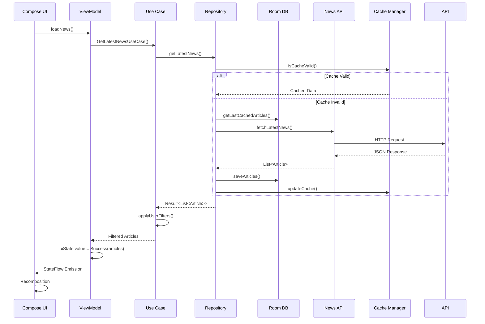

# GRAB - System Design Q&A

This document covers potential system design and architecture questions about the GRAB project with detailed answers for interview preparation.

## 📊 High-Level System Design Questions

### Q1: Walk me through the overall architecture of your news application.

**Answer:**
GRAB follows a Clean Architecture approach with three main layers:

```
┌─────────────────────────────────────────────────────────┐
│                 PRESENTATION LAYER                      │
│  ┌─────────────┐  ┌─────────────┐  ┌─────────────┐      │
│  │   Compose   │  │  ViewModels │  │ Navigation  │      │
│  │     UI      │  │             │  │ Component   │      │
│  └─────────────┘  └─────────────┘  └─────────────┘      │
└─────────────────────────────────────────────────────────┘
                            │
┌─────────────────────────────────────────────────────────┐
│                   DOMAIN LAYER                         │
│  ┌─────────────┐  ┌─────────────┐  ┌─────────────┐      │
│  │  Use Cases  │  │ Repository  │  │   Domain    │      │
│  │             │  │ Interfaces  │  │   Models    │      │
│  └─────────────┘  └─────────────┘  └─────────────┘      │
└─────────────────────────────────────────────────────────┘
                            │
┌─────────────────────────────────────────────────────────┐
│                    DATA LAYER                          │
│  ┌─────────────┐  ┌─────────────┐  ┌─────────────┐      │
│  │ Repository  │  │    Local    │  │   Remote    │      │
│  │   Impl      │  │ DataSource  │  │ DataSource  │      │
│  └─────────────┘  └─────────────┘  └─────────────┘      │
└─────────────────────────────────────────────────────────┘
```

**Key Benefits:**
- **Testability**: Each layer can be tested in isolation
- **Maintainability**: Changes in one layer don't affect others
- **Scalability**: Easy to add new features or swap implementations
- **Dependency Inversion**: High-level modules don't depend on low-level modules

### Q2: How would you scale this application to handle millions of users?

**Answer:**

#### Client-Side Scaling:
1. **Efficient Caching Strategy**
   ```kotlin
   // Multi-level caching implementation
   class ScalableCacheManager {
       private val memoryCache = LruCache<String, List<Article>>(100)
       private val diskCache = DiskLruCache.open(...)
       
       suspend fun getArticles(key: String): List<Article>? {
           // Level 1: Memory (fastest)
           memoryCache.get(key)?.let { return it }
           
           // Level 2: Disk (fast)
           diskCache.get(key)?.let { articles ->
               memoryCache.put(key, articles)
               return articles
           }
           
           return null
       }
   }
   ```

2. **Pagination & Lazy Loading**
   ```kotlin
   @OptIn(ExperimentalPagingApi::class)
   class NewsRemoteMediator : RemoteMediator<Int, Article>() {
       override suspend fun load(
           loadType: LoadType,
           state: PagingState<Int, Article>
       ): MediatorResult {
           // Implement efficient pagination with RemoteKeys
       }
   }
   ```

3. **Background Sync Optimization**
   ```kotlin
   class NewsSyncWorker : CoroutineWorker() {
       override suspend fun doWork(): Result {
           // Sync only when on WiFi and device charging
           // Use exponential backoff for retries
       }
   }
   ```

#### Backend Scaling Considerations:
1. **CDN Integration**: Cache images and static content
2. **Database Sharding**: Partition news data by category/region
3. **Microservices**: Separate services for articles, users, recommendations
4. **Load Balancing**: Distribute requests across multiple servers
5. **Caching Layer**: Redis for frequently accessed data

### Q3: How do you handle data consistency between local and remote data?

**Answer:**

**Strategy: Repository Pattern with Conflict Resolution**

```kotlin
class NewsRepository {
    suspend fun syncArticles(): Result<List<Article>> {
        return try {
            // 1. Get last sync timestamp
            val lastSync = userManager.getLastSyncTime()
            
            // 2. Fetch updates since last sync
            val updates = api.getArticlesSince(lastSync)
            
            // 3. Resolve conflicts
            val resolvedArticles = resolveConflicts(updates)
            
            // 4. Update local database
            database.withTransaction {
                database.articleDao().insertAll(resolvedArticles)
                userManager.updateLastSyncTime(System.currentTimeMillis())
            }
            
            Result.success(resolvedArticles)
        } catch (exception: Exception) {
            Result.failure(exception)
        }
    }
    
    private suspend fun resolveConflicts(
        remoteArticles: List<Article>
    ): List<Article> {
        return remoteArticles.map { remoteArticle ->
            val localArticle = database.articleDao().getByUrl(remoteArticle.url)
            
            when {
                localArticle == null -> remoteArticle
                localArticle.lastModified < remoteArticle.lastModified -> remoteArticle
                localArticle.isBookmarked && !remoteArticle.isBookmarked -> {
                    // Keep local bookmark status
                    remoteArticle.copy(isBookmarked = true)
                }
                else -> remoteArticle
            }
        }
    }
}
```

### Q4: Design the database schema for a news application.

**Answer:**

```sql
-- Articles table (main content)
CREATE TABLE articles (
    url TEXT PRIMARY KEY,                    -- Unique identifier
    title TEXT NOT NULL,
    description TEXT,
    content TEXT,
    image_url TEXT,
    published_at TIMESTAMP NOT NULL,
    source_id TEXT NOT NULL,
    source_name TEXT NOT NULL,
    category TEXT DEFAULT 'general',
    language TEXT DEFAULT 'en',
    is_bookmarked BOOLEAN DEFAULT FALSE,
    created_at TIMESTAMP DEFAULT CURRENT_TIMESTAMP,
    updated_at TIMESTAMP DEFAULT CURRENT_TIMESTAMP,
    
    FOREIGN KEY (source_id) REFERENCES sources(id),
    INDEX idx_published_at (published_at),
    INDEX idx_category (category),
    INDEX idx_bookmarked (is_bookmarked)
);

-- Sources table (news providers)
CREATE TABLE sources (
    id TEXT PRIMARY KEY,
    name TEXT NOT NULL UNIQUE,
    description TEXT,
    url TEXT,
    category TEXT,
    country TEXT,
    language TEXT,
    is_active BOOLEAN DEFAULT TRUE,
    created_at TIMESTAMP DEFAULT CURRENT_TIMESTAMP
);

-- Users table (authentication)
CREATE TABLE users (
    uid TEXT PRIMARY KEY,
    email TEXT UNIQUE NOT NULL,
    display_name TEXT,
    photo_url TEXT,
    last_login_at TIMESTAMP,
    preferences TEXT, -- JSON blob for user preferences
    created_at TIMESTAMP DEFAULT CURRENT_TIMESTAMP
);

-- User bookmarks (many-to-many relationship)
CREATE TABLE user_bookmarks (
    user_id TEXT NOT NULL,
    article_url TEXT NOT NULL,
    bookmarked_at TIMESTAMP DEFAULT CURRENT_TIMESTAMP,
    
    PRIMARY KEY (user_id, article_url),
    FOREIGN KEY (user_id) REFERENCES users(uid) ON DELETE CASCADE,
    FOREIGN KEY (article_url) REFERENCES articles(url) ON DELETE CASCADE
);

-- Chat history (AI conversations)
CREATE TABLE chat_messages (
    id INTEGER PRIMARY KEY AUTOINCREMENT,
    user_id TEXT NOT NULL,
    message TEXT NOT NULL,
    response TEXT NOT NULL,
    article_url TEXT, -- Optional: if chat is about specific article
    created_at TIMESTAMP DEFAULT CURRENT_TIMESTAMP,
    
    FOREIGN KEY (user_id) REFERENCES users(uid) ON DELETE CASCADE,
    FOREIGN KEY (article_url) REFERENCES articles(url) ON DELETE SET NULL,
    INDEX idx_user_created (user_id, created_at)
);

-- Search history (for analytics and recommendations)
CREATE TABLE search_history (
    id INTEGER PRIMARY KEY AUTOINCREMENT,
    user_id TEXT,
    query TEXT NOT NULL,
    results_count INTEGER DEFAULT 0,
    created_at TIMESTAMP DEFAULT CURRENT_TIMESTAMP,
    
    FOREIGN KEY (user_id) REFERENCES users(uid) ON DELETE CASCADE,
    INDEX idx_user_query (user_id, query)
);
```

**Room Database Implementation:**
```kotlin
@Entity(tableName = "articles")
data class ArticleEntity(
    @PrimaryKey val url: String,
    val title: String,
    val description: String?,
    val content: String?,
    @ColumnInfo(name = "image_url") val imageUrl: String?,
    @ColumnInfo(name = "published_at") val publishedAt: String,
    @ColumnInfo(name = "source_id") val sourceId: String,
    @ColumnInfo(name = "source_name") val sourceName: String,
    val category: String = "general",
    @ColumnInfo(name = "is_bookmarked") val isBookmarked: Boolean = false,
    @ColumnInfo(name = "created_at") val createdAt: Long = System.currentTimeMillis()
)

@Dao
interface ArticleDao {
    @Query("SELECT * FROM articles ORDER BY published_at DESC LIMIT :limit OFFSET :offset")
    suspend fun getArticlesPaged(limit: Int, offset: Int): List<ArticleEntity>
    
    @Query("SELECT * FROM articles WHERE is_bookmarked = 1 ORDER BY created_at DESC")
    fun getBookmarkedArticlesFlow(): Flow<List<ArticleEntity>>
    
    @Query("""
        SELECT * FROM articles 
        WHERE title LIKE '%' || :query || '%' 
           OR description LIKE '%' || :query || '%'
        ORDER BY published_at DESC
    """)
    suspend fun searchArticles(query: String): List<ArticleEntity>
}
```

## 🔄 Data Flow & State Management

### Q5: Explain the data flow in your application from API call to UI display.

**Answer:**



**Code Implementation:**
```kotlin
// 1. UI Layer - Compose Screen
@Composable
fun HomeScreen(viewModel: HomeViewModel = hiltViewModel()) {
    val uiState by viewModel.uiState.collectAsState()
    
    LaunchedEffect(Unit) {
        viewModel.loadNews()
    }
    
    when (uiState) {
        is HomeUiState.Loading -> LoadingIndicator()
        is HomeUiState.Success -> ArticleList(uiState.articles)
        is HomeUiState.Error -> ErrorMessage(uiState.message)
    }
}

// 2. Presentation Layer - ViewModel
@HiltViewModel
class HomeViewModel @Inject constructor(
    private val getLatestNewsUseCase: GetLatestNewsUseCase
) : ViewModel() {
    
    private val _uiState = MutableStateFlow<HomeUiState>(HomeUiState.Loading)
    val uiState: StateFlow<HomeUiState> = _uiState.asStateFlow()
    
    fun loadNews() {
        viewModelScope.launch {
            getLatestNewsUseCase()
                .onSuccess { articles ->
                    _uiState.value = HomeUiState.Success(articles)
                }
                .onFailure { error ->
                    _uiState.value = HomeUiState.Error(error.message ?: "Unknown error")
                }
        }
    }
}

// 3. Domain Layer - Use Case
class GetLatestNewsUseCase @Inject constructor(
    private val newsRepository: NewsRepository,
    private val userManager: LocalUserManager
) {
    suspend operator fun invoke(): Result<List<Article>> {
        return try {
            val userPreferences = userManager.getUserPreferences()
            val articles = newsRepository.getLatestNews().getOrThrow()
            
            val filteredArticles = articles.filter { article ->
                userPreferences.preferredCategories.isEmpty() ||
                article.category in userPreferences.preferredCategories
            }
            
            Result.success(filteredArticles)
        } catch (exception: Exception) {
            Result.failure(exception)
        }
    }
}
```

### Q6: How do you manage state across different screens?

**Answer:**

**Strategy: Centralized State Management with Navigation**

```kotlin
// 1. Shared ViewModels for cross-screen state
@HiltViewModel
class AppViewModel @Inject constructor(
    private val userManager: LocalUserManager,
    private val newsRepository: NewsRepository
) : ViewModel() {
    
    // Global app state
    private val _appState = MutableStateFlow(AppState())
    val appState: StateFlow<AppState> = _appState.asStateFlow()
    
    // User authentication state
    val isLoggedIn: StateFlow<Boolean> = userManager.isLoggedInFlow()
        .stateIn(viewModelScope, SharingStarted.Eagerly, false)
    
    // Global loading state
    private val _isLoading = MutableStateFlow(false)
    val isLoading: StateFlow<Boolean> = _isLoading.asStateFlow()
    
    // Bookmarked articles (shared across screens)
    val bookmarkedArticles: StateFlow<List<Article>> = 
        newsRepository.getBookmarkedArticles()
            .stateIn(viewModelScope, SharingStarted.Lazily, emptyList())
}

// 2. Navigation with shared state
@Composable
fun GrabNavGraph(
    navController: NavHostController,
    appViewModel: AppViewModel
) {
    val appState by appViewModel.appState.collectAsState()
    val isLoggedIn by appViewModel.isLoggedIn.collectAsState()
    
    NavHost(
        navController = navController,
        startDestination = if (isLoggedIn) Routes.Home else Routes.Auth
    ) {
        composable(Routes.Home) {
            HomeScreen(
                onNavigateToDetails = { article ->
                    navController.navigate("${Routes.Details}/${article.url}")
                },
                sharedState = appState
            )
        }
        
        composable("${Routes.Details}/{articleUrl}") { backStackEntry ->
            val articleUrl = backStackEntry.arguments?.getString("articleUrl")
            DetailsScreen(
                articleUrl = articleUrl,
                bookmarkedArticles = appState.bookmarkedArticles,
                onBookmarkToggle = { article ->
                    appViewModel.toggleBookmark(article)
                }
            )
        }
    }
}

// 3. State persistence across process death
class AppStateManager @Inject constructor(
    private val dataStore: DataStore<Preferences>
) {
    private val LAST_SELECTED_TAB = stringPreferencesKey("last_selected_tab")
    private val LAST_SEARCH_QUERY = stringPreferencesKey("last_search_query")
    
    suspend fun saveAppState(state: AppState) {
        dataStore.edit { preferences ->
            preferences[LAST_SELECTED_TAB] = state.selectedTab
            preferences[LAST_SEARCH_QUERY] = state.lastSearchQuery
        }
    }
    
    fun getAppStateFlow(): Flow<AppState> {
        return dataStore.data.map { preferences ->
            AppState(
                selectedTab = preferences[LAST_SELECTED_TAB] ?: "home",
                lastSearchQuery = preferences[LAST_SEARCH_QUERY] ?: ""
            )
        }
    }
}
```

## 🔧 Performance & Optimization

### Q7: How would you optimize the performance of image loading in your news app?

**Answer:**

**Multi-Level Image Optimization Strategy:**

```kotlin
// 1. Coil Configuration with custom caching
@Module
@InstallIn(SingletonComponent::class)
object ImageModule {
    
    @Provides
    @Singleton
    fun provideImageLoader(@ApplicationContext context: Context): ImageLoader {
        return ImageLoader.Builder(context)
            .memoryCache {
                MemoryCache.Builder(context)
                    .maxSizePercent(0.25) // Use 25% of available memory
                    .strongReferencesEnabled(true)
                    .build()
            }
            .diskCache {
                DiskCache.Builder()
                    .directory(context.cacheDir.resolve("image_cache"))
                    .maxSizeBytes(100 * 1024 * 1024) // 100MB disk cache
                    .build()
            }
            .components {
                add(SvgDecoder.Factory()) // Support SVG images
            }
            .respectCacheHeaders(false) // Override server cache headers
            .build()
    }
}

// 2. Optimized Image Composable
@Composable
fun OptimizedNetworkImage(
    imageUrl: String?,
    contentDescription: String?,
    modifier: Modifier = Modifier,
    contentScale: ContentScale = ContentScale.Crop
) {
    val context = LocalContext.current
    val imageSize = remember { mutableStateOf(IntSize.Zero) }
    
    AsyncImage(
        model = ImageRequest.Builder(context)
            .data(imageUrl)
            .size(imageSize.value.width, imageSize.value.height) // Load at exact size
            .crossfade(300) // Smooth transition
            .allowHardware(false) // Prevent issues with some devices
            .build(),
        contentDescription = contentDescription,
        modifier = modifier.onSizeChanged { size -> imageSize.value = size },
        contentScale = contentScale,
        placeholder = painterResource(R.drawable.placeholder_shimmer),
        error = painterResource(R.drawable.error_placeholder),
        loading = {
            Box(
                modifier = Modifier.fillMaxSize(),
                contentAlignment = Alignment.Center
            ) {
                CircularProgressIndicator(
                    modifier = Modifier.size(24.dp),
                    strokeWidth = 2.dp
                )
            }
        }
    )
}

// 3. Image preloading for better UX
class ImagePreloader @Inject constructor(
    private val imageLoader: ImageLoader,
    @ApplicationContext private val context: Context
) {
    suspend fun preloadImages(articles: List<Article>) {
        articles.mapNotNull { it.imageUrl }
            .take(5) // Preload first 5 images
            .forEach { url ->
                imageLoader.execute(
                    ImageRequest.Builder(context)
                        .data(url)
                        .size(800, 600) // Standard size
                        .build()
                )
            }
    }
}

// 4. Lazy loading with pagination
@Composable
fun ArticleList(
    articles: LazyPagingItems<Article>,
    onArticleClick: (Article) -> Unit
) {
    LazyColumn {
        items(articles) { article ->
            article?.let {
                ArticleCard(
                    article = it,
                    onClick = onArticleClick,
                    modifier = Modifier
                        .fillMaxWidth()
                        .padding(horizontal = 16.dp, vertical = 8.dp)
                )
            }
        }
    }
}
```

### Q8: How do you handle memory management and prevent memory leaks?

**Answer:**

**Comprehensive Memory Management Strategy:**

```kotlin
// 1. ViewModel lifecycle management
@HiltViewModel
class HomeViewModel @Inject constructor(
    private val getNewsUseCase: GetLatestNewsUseCase
) : ViewModel() {
    
    private val _uiState = MutableStateFlow(HomeUiState.Loading)
    val uiState: StateFlow<HomeUiState> = _uiState.asStateFlow()
    
    // Jobs are automatically cancelled when ViewModel is cleared
    fun loadNews() {
        viewModelScope.launch {
            // This coroutine is tied to ViewModel lifecycle
            getNewsUseCase().collect { result ->
                _uiState.value = when (result) {
                    is Result.Success -> HomeUiState.Success(result.data)
                    is Result.Error -> HomeUiState.Error(result.message)
                }
            }
        }
    }
    
    override fun onCleared() {
        super.onCleared()
        // viewModelScope automatically cancels all coroutines
    }
}

// 2. Proper Compose state management
@Composable
fun HomeScreen(viewModel: HomeViewModel = hiltViewModel()) {
    val uiState by viewModel.uiState.collectAsState()
    
    // Use DisposableEffect for cleanup
    DisposableEffect(Unit) {
        viewModel.startLocationUpdates()
        
        onDispose {
            viewModel.stopLocationUpdates()
        }
    }
    
    // LaunchedEffect is cancelled when key changes or composable leaves composition
    LaunchedEffect(uiState) {
        if (uiState is HomeUiState.Error) {
            // Show error message
        }
    }
}

// 3. Repository pattern prevents leaks
@Singleton
class NewsRepository @Inject constructor(
    private val api: NewsApi,
    private val database: NewsDatabase
) {
    // Use Flow for reactive data that automatically handles lifecycle
    fun getArticlesFlow(): Flow<List<Article>> {
        return database.articleDao().getAllArticlesFlow()
            .map { entities -> entities.map { it.toDomainModel() } }
            .flowOn(Dispatchers.IO)
    }
    
    // Proper resource management
    suspend fun downloadLargeFile(url: String): Result<File> = withContext(Dispatchers.IO) {
        var inputStream: InputStream? = null
        var outputStream: FileOutputStream? = null
        
        try {
            val response = api.downloadFile(url)
            inputStream = response.byteStream()
            
            val file = File.createTempFile("download", ".tmp")
            outputStream = FileOutputStream(file)
            
            inputStream.copyTo(outputStream)
            Result.success(file)
        } catch (e: Exception) {
            Result.failure(e)
        } finally {
            inputStream?.close()
            outputStream?.close()
        }
    }
}

// 4. Memory-efficient data structures
class ArticleCache {
    private val lruCache = LruCache<String, Article>(
        50 // Max 50 articles in memory
    ) { key, value ->
        // Calculate memory usage of each article
        value.title.length + value.description.length + value.content.length
    }
    
    fun get(key: String): Article? = lruCache.get(key)
    fun put(key: String, article: Article) = lruCache.put(key, article)
}

// 5. Database connection management
@Module
@InstallIn(SingletonComponent::class)
object DatabaseModule {
    
    @Provides
    @Singleton
    fun provideDatabase(@ApplicationContext context: Context): NewsDatabase {
        return Room.databaseBuilder(
            context,
            NewsDatabase::class.java,
            "news_database"
        )
        .setJournalMode(RoomDatabase.JournalMode.TRUNCATE) // Optimize for performance
        .setQueryCallback({ sqlQuery, bindArgs ->
            Log.d("RoomQuery", "SQL: $sqlQuery, Args: $bindArgs")
        }, Dispatchers.IO)
        .build()
    }
}
```

## 🔐 Security & Authentication

### Q9: How do you implement secure authentication in your application?

**Answer:**

**Multi-Layer Security Approach:**

```kotlin
// 1. Firebase Authentication with Google Sign-In
class AuthRepository @Inject constructor(
    private val firebaseAuth: FirebaseAuth,
    private val credentialManager: CredentialManager,
    private val tokenManager: TokenManager
) {
    
    suspend fun signInWithGoogle(): Result<User> = withContext(Dispatchers.IO) {
        try {
            // Use Credential Manager API for secure credential handling
            val googleIdOption = GetGoogleIdOption.Builder()
                .setFilterByAuthorizedAccounts(false)
                .setServerClientId(BuildConfig.WEB_CLIENT_ID)
                .build()
            
            val request = GetCredentialRequest.Builder()
                .addCredentialOption(googleIdOption)
                .build()
            
            val credential = credentialManager.getCredential(
                context = context,
                request = request
            )
            
            val googleIdTokenCredential = GoogleIdTokenCredential
                .createFrom(credential.credential.data)
            
            val googleCredential = GoogleAuthProvider.getCredential(
                googleIdTokenCredential.idToken, null
            )
            
            val authResult = firebaseAuth.signInWithCredential(googleCredential).await()
            val user = authResult.user?.toUser() ?: throw AuthException("Sign in failed")
            
            // Securely store tokens
            tokenManager.saveTokens(
                accessToken = googleIdTokenCredential.idToken,
                refreshToken = authResult.user?.getIdToken(false)?.await()?.token
            )
            
            Result.success(user)
        } catch (exception: Exception) {
            Result.failure(AuthException("Authentication failed: ${exception.message}"))
        }
    }
}

// 2. Secure Token Management
@Singleton
class TokenManager @Inject constructor(
    private val encryptedPrefs: SharedPreferences,
    private val keyManager: KeyManager
) {
    
    suspend fun saveTokens(accessToken: String, refreshToken: String?) {
        val encryptedAccessToken = keyManager.encrypt(accessToken)
        val encryptedRefreshToken = refreshToken?.let { keyManager.encrypt(it) }
        
        encryptedPrefs.edit {
            putString(ACCESS_TOKEN_KEY, encryptedAccessToken)
            refreshToken?.let { putString(REFRESH_TOKEN_KEY, encryptedRefreshToken) }
            putLong(TOKEN_TIMESTAMP_KEY, System.currentTimeMillis())
        }
    }
    
    suspend fun getAccessToken(): String? {
        val encryptedToken = encryptedPrefs.getString(ACCESS_TOKEN_KEY, null)
        return encryptedToken?.let { keyManager.decrypt(it) }
    }
    
    suspend fun isTokenValid(): Boolean {
        val timestamp = encryptedPrefs.getLong(TOKEN_TIMESTAMP_KEY, 0)
        val now = System.currentTimeMillis()
        return (now - timestamp) < TOKEN_EXPIRY_TIME
    }
}

// 3. Network Security
class ApiKeyInterceptor : Interceptor {
    override fun intercept(chain: Interceptor.Chain): Response {
        val original = chain.request()
        
        // Add API key securely
        val request = original.newBuilder()
            .addHeader("Authorization", "Bearer ${getSecureApiKey()}")
            .addHeader("User-Agent", "GrabApp/${BuildConfig.VERSION_NAME}")
            .build()
        
        return chain.proceed(request)
    }
    
    private fun getSecureApiKey(): String {
        // Retrieve from secure storage, not hardcoded
        return BuildConfig.NEWS_API_KEY // This comes from secure build configuration
    }
}

// 4. Certificate Pinning
@Module
@InstallIn(SingletonComponent::class)
object NetworkSecurityModule {
    
    @Provides
    @Singleton
    fun provideOkHttpClient(): OkHttpClient {
        val certificatePinner = CertificatePinner.Builder()
            .add("newsapi.org", "sha256/AAAAAAAAAAAAAAAAAAAAAAAAAAAAAAAAAAAAAAAAAAA=")
            .add("googleapis.com", "sha256/BBBBBBBBBBBBBBBBBBBBBBBBBBBBBBBBBBBBBBBBBBB=")
            .build()
        
        return OkHttpClient.Builder()
            .certificatePinner(certificatePinner)
            .addInterceptor(ApiKeyInterceptor())
            .addInterceptor(HttpLoggingInterceptor().apply {
                level = if (BuildConfig.DEBUG) {
                    HttpLoggingInterceptor.Level.BODY
                } else {
                    HttpLoggingInterceptor.Level.NONE
                }
            })
            .connectTimeout(30, TimeUnit.SECONDS)
            .readTimeout(30, TimeUnit.SECONDS)
            .build()
    }
}
```

### Q10: How would you implement offline synchronization?

**Answer:**

**Offline-First Architecture with Conflict Resolution:**

```kotlin
// 1. Sync Manager
@Singleton
class SyncManager @Inject constructor(
    private val newsRepository: NewsRepository,
    private val userRepository: UserRepository,
    private val networkMonitor: NetworkMonitor,
    private val workManager: WorkManager
) {
    
    suspend fun scheduleSync() {
        val constraints = Constraints.Builder()
            .setRequiredNetworkType(NetworkType.CONNECTED)
            .setRequiresBatteryNotLow(true)
            .build()
        
        val syncRequest = OneTimeWorkRequestBuilder<SyncWorker>()
            .setConstraints(constraints)
            .setBackoffCriteria(
                BackoffPolicy.EXPONENTIAL,
                Duration.ofMinutes(15)
            )
            .build()
        
        workManager.enqueueUniqueWork(
            "news_sync",
            ExistingWorkPolicy.REPLACE,
            syncRequest
        )
    }
    
    suspend fun performSync(): SyncResult {
        return try {
            val lastSyncTime = userRepository.getLastSyncTime()
            
            // 1. Sync articles
            val articlesSyncResult = syncArticles(lastSyncTime)
            
            // 2. Sync user data (bookmarks, preferences)
            val userDataSyncResult = syncUserData(lastSyncTime)
            
            // 3. Update last sync time
            userRepository.updateLastSyncTime(System.currentTimeMillis())
            
            SyncResult.Success(
                articlesUpdated = articlesSyncResult.count,
                conflictsResolved = articlesSyncResult.conflicts
            )
        } catch (exception: Exception) {
            SyncResult.Failure(exception.message ?: "Sync failed")
        }
    }
    
    private suspend fun syncArticles(lastSyncTime: Long): ArticlesSyncResult {
        val localChanges = newsRepository.getLocalChanges(lastSyncTime)
        val remoteChanges = newsRepository.getRemoteChanges(lastSyncTime)
        
        val conflicts = detectConflicts(localChanges, remoteChanges)
        val resolvedChanges = resolveConflicts(conflicts)
        
        // Apply resolved changes
        newsRepository.applyChanges(resolvedChanges)
        
        return ArticlesSyncResult(
            count = resolvedChanges.size,
            conflicts = conflicts.size
        )
    }
}

// 2. Conflict Resolution Strategy
class ConflictResolver {
    
    fun resolveConflicts(conflicts: List<ArticleConflict>): List<Article> {
        return conflicts.map { conflict ->
            when (conflict.type) {
                ConflictType.BOOKMARK_MISMATCH -> {
                    // Local bookmark changes take precedence
                    conflict.remoteArticle.copy(
                        isBookmarked = conflict.localArticle.isBookmarked
                    )
                }
                ConflictType.CONTENT_UPDATED -> {
                    // Remote content takes precedence for news articles
                    if (conflict.remoteArticle.updatedAt > conflict.localArticle.updatedAt) {
                        conflict.remoteArticle
                    } else {
                        conflict.localArticle
                    }
                }
                ConflictType.DELETION_CONFLICT -> {
                    // If user bookmarked locally but article deleted remotely, keep it
                    if (conflict.localArticle.isBookmarked) {
                        conflict.localArticle.copy(isDeleted = false)
                    } else {
                        null // Allow deletion
                    }
                }
            }
        }.filterNotNull()
    }
}

// 3. Repository with offline support
@Singleton
class NewsRepository @Inject constructor(
    private val localDataSource: NewsLocalDataSource,
    private val remoteDataSource: NewsRemoteDataSource,
    private val syncQueue: SyncQueue
) {
    
    // Always return local data first (offline-first)
    fun getArticles(): Flow<List<Article>> {
        return localDataSource.getArticlesFlow()
    }
    
    suspend fun bookmarkArticle(article: Article): Result<Unit> {
        return try {
            // 1. Update locally immediately
            val updatedArticle = article.copy(
                isBookmarked = !article.isBookmarked,
                lastModified = System.currentTimeMillis()
            )
            localDataSource.updateArticle(updatedArticle)
            
            // 2. Queue for sync when online
            syncQueue.enqueue(
                SyncOperation.BookmarkUpdate(
                    articleUrl = article.url,
                    isBookmarked = updatedArticle.isBookmarked,
                    timestamp = updatedArticle.lastModified
                )
            )
            
            Result.success(Unit)
        } catch (exception: Exception) {
            Result.failure(exception)
        }
    }
    
    suspend fun refreshArticles(): Result<List<Article>> {
        return if (networkMonitor.isOnline()) {
            try {
                val remoteArticles = remoteDataSource.getLatestArticles()
                localDataSource.replaceArticles(remoteArticles)
                Result.success(remoteArticles)
            } catch (exception: Exception) {
                // Fallback to local data
                val localArticles = localDataSource.getAllArticles()
                Result.success(localArticles)
            }
        } else {
            // Return cached data when offline
            val localArticles = localDataSource.getAllArticles()
            Result.success(localArticles)
        }
    }
}

// 4. Network Monitor
@Singleton
class NetworkMonitor @Inject constructor(
    @ApplicationContext private val context: Context
) {
    
    private val connectivityManager = context.getSystemService<ConnectivityManager>()
    
    private val _isOnline = MutableStateFlow(false)
    val isOnline: StateFlow<Boolean> = _isOnline.asStateFlow()
    
    init {
        val networkCallback = object : ConnectivityManager.NetworkCallback() {
            override fun onAvailable(network: Network) {
                _isOnline.value = true
            }
            
            override fun onLost(network: Network) {
                _isOnline.value = false
            }
        }
        
        val request = NetworkRequest.Builder()
            .addCapability(NetworkCapabilities.NET_CAPABILITY_INTERNET)
            .build()
        
        connectivityManager?.registerNetworkCallback(request, networkCallback)
    }
    
    fun isOnline(): Boolean = _isOnline.value
}
```

These system design answers demonstrate deep understanding of scalable architecture, performance optimization, security best practices, and complex data synchronization patterns that are essential for production-level applications.